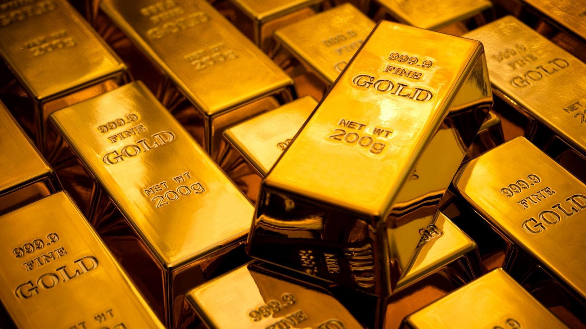

# Gold-Price-Prediction-using-Random-Forest

## Introduction to the project
GOLD has been a prominent asset for any nation. It has proved its worth many times during crisis when other asssets experience a decline in their values. Gold is viewed as a strategic and tactical investment. 

## HOW TO USE THE DEPLOYED MODEL
Use the slider to input the different values of SPX (Standard & Poor's 500 Index), USO (United States Oil), SLV (iShares Silver Trust), EUR/USD (European Unioun Euro against United States Dollar) using the slider provided for each individual category to get the price of the gold.
[For reference, check input-output screenshot folder in the repository]

## Used libraries
In this project, the dataset is trained on Random Forest Regressor machine learning model. Used libraries: 
* `pandas` for data manipulation 
* `Seaborn` and `Matplotlib` for data visualisation
* `Sklearn` for training the model and deriving the errors and accuracy.
* `pickle` module to dump the model to save and load it
* `streamlit` library for deployment and hosting

## Methodology used
1. Fetching Gold Dataset from Kaggle
2. Data Exploratory Analysis like Skewness and Kurtosis
3. Data Preprocessing with redundant column removal
4. Training the model on the dataset (used Random Forest Regressor)
5. Predicting the labels
6. Evaluation using regression metrics 
7. Deploying the model and hosting on Streamlit
8. Getting inputs from the user using sliders
9. Estimating the gold price on the basis of the column feature

## Hyperparameter tuning?
Hyperparameter tuning was not needed since the trainind accuracy is `99.843%` and test set accuracy is  `98.996%`
